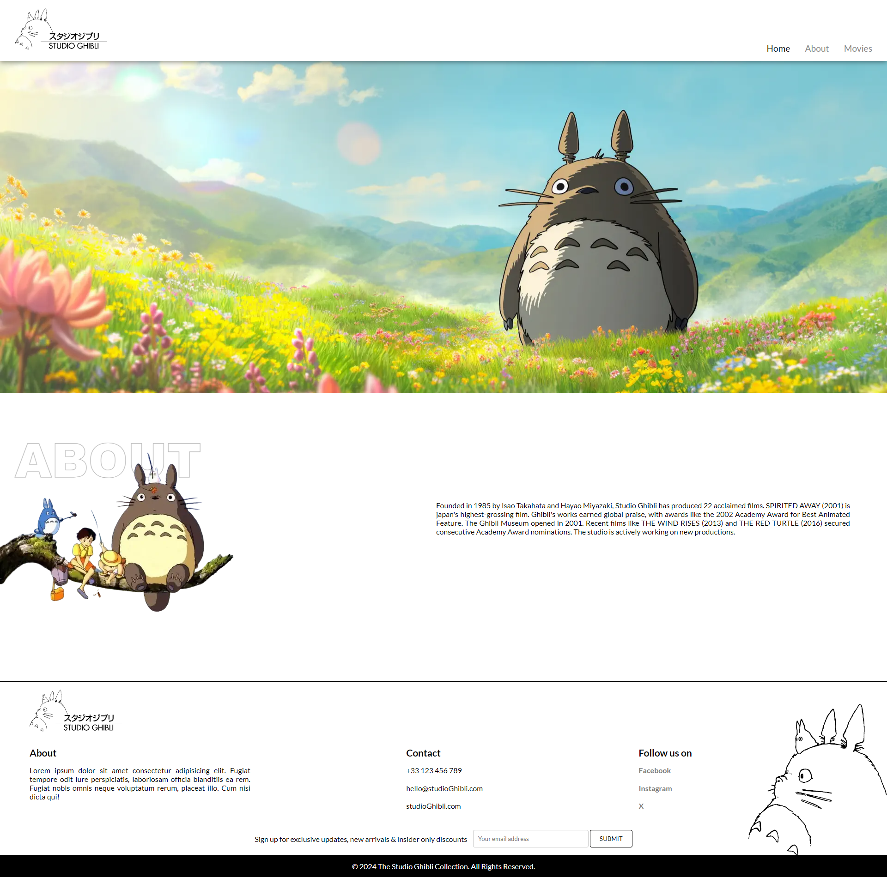
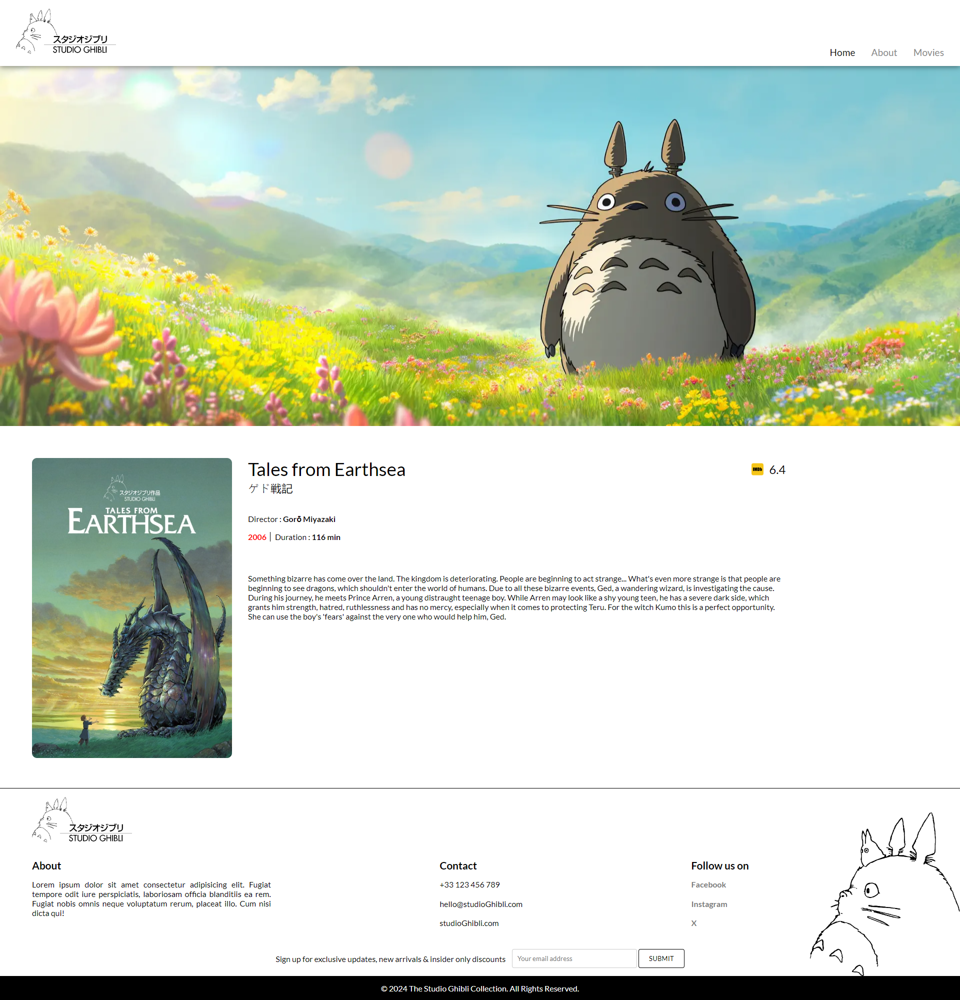

<div align="center">
  
# Studio Ghibli Website


</div><br>

This is a fan-made website dedicated to the beloved films of Studio Ghibli. The website showcases the studio's rich history and its iconic movies, providing an engaging experience for fans and newcomers alike.

## Features

- **Home Page**: Displays a banner with iconic scenes from Studio Ghibli movies.
- **About Section**: Provides a brief history of Studio Ghibli, highlighting key achievements and awards.
- **Movies Page**: Showcases a collection of popular Studio Ghibli films with details such as release dates and movie posters.
- **Footer**: Includes contact information, social media links, and a subscription form for updates.

## Technologies Used

- **HTML**: For the structure of the web pages.
- **CSS**: For styling the website and enhancing its visual appeal.
- **JavaScript**: For interactive elements and dynamic content.
- **Node.js**: For server-side scripting.
- **Express.js**: For building the web application framework.
- **PostgreSQL**: For the database to store movie details and other data.

## Installation

To run this project locally, follow these steps:

1. **Clone the repository**:

    ```sh
    git clone git@github.com:LevequeKevin/Ghibli-Collection.git
    ```

2. **Navigate to the project directory**:

    ```sh
    cd Ghibli-Collection
    ```

3. **Install the dependencies**:

    ```sh
    npm install
    ```

4. **Set up the PostgreSQL database**:
    - Create a new PostgreSQL databasewith data/create_db.sql
    - Update the database configuration in a `.env` file with your database credentials.

5. **Start the server**:

    ```sh
    npm run dev
    ```

## Acknowledgements

- Studio Ghibli for the inspiration and wonderful movies.
- Ujwal vinay for the [Mockup](https://dribbble.com/shots/23062504-ANIME-WEBSITE-Studio-Ghibli)
- Data were found on this [repo](https://github.com/janaipakos/ghibliapi) (under MIT license)
  
## License

This project is licensed under the MIT License. See the [LICENSE](LICENSE) file for more details.

## Image Credits

- Studio Ghibli

---

### Screenshot





---
